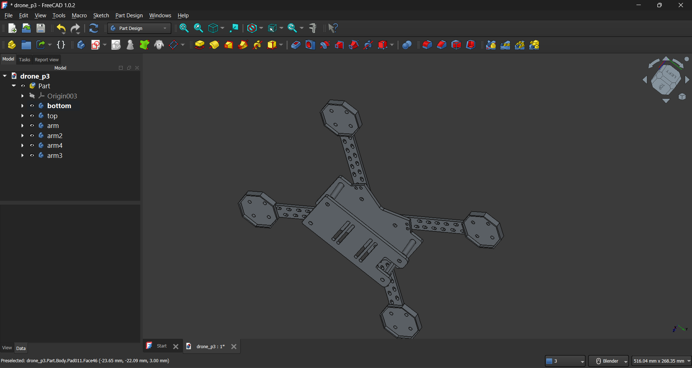
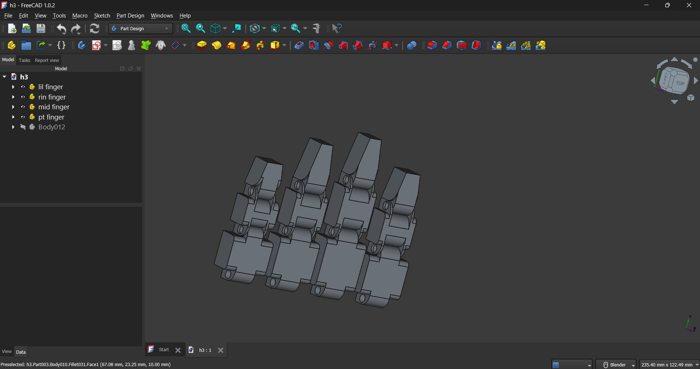

## 3D Models – FreeCAD Projects

* This repository contains my 3D CAD models designed using FreeCAD, focused on functional, manufacturable mechanical designs.
* The models are created with real-world applications in mind such as drones, structural frames, and embedded system enclosures.
---

#Few Images:

  

  

